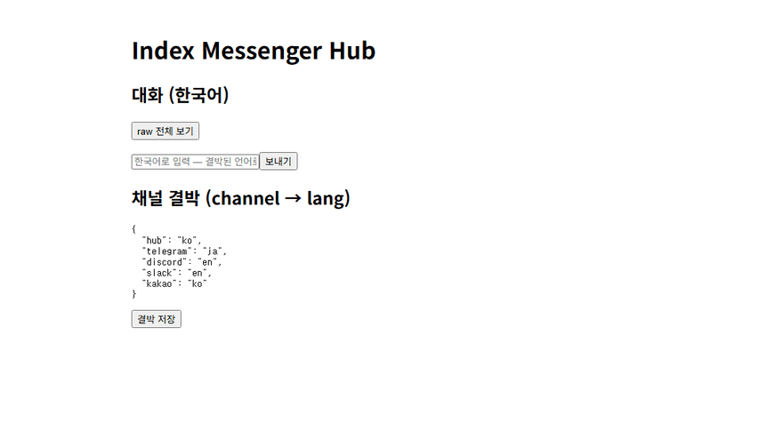
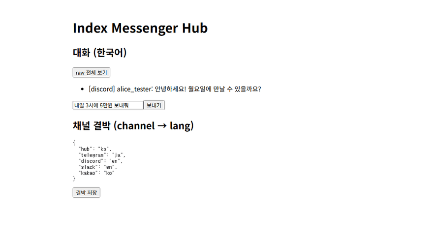

# INDEX Messenger 선언문 v2
## 두 개의 방

제네바의 어느 실무 채널. 여덟 나라의 실무자들이 새벽까지 문안을 조율한다. 단상 위의 대표들에게는 동시통역이 있지만, 협상의 실체가 굴러가는 이 채팅방에는 아무것도 없다. 모두가 어중간한 공용어로 다투고, 그 언어가 모국어인 사람이 늘 반 발 앞선다.

어느 공단의 작업 단톡방. 한국인 관리자와 네팔, 베트남에서 온 동료들이 있다. 내일 작업 지시가 전달되지만, 절반은 뜻이 절반만 닿는다.

두 방은 같은 방이다. 말이 통하는 사람과 통하지 않는 사람 사이의 격차가, 그대로 힘의 격차가 되는 방. INDEX Messenger는 이 방들을 위해 만들어졌다.





## 1부 — 문제: 책임은 늘 경계 밖으로 밀려났다

메신저 플랫폼들은 장벽을 쌓았다. 당신의 대화는 그들의 성 안에 있고, 성과 성 사이를 오가는 부담은 당신의 몫이다. 그들은 이것을 보호라고 부르지만, 성벽이 지키는 것은 사용자가 아니라 성이다.

AI는 가능성을 만들었다. 그러나 생성의 힘을 파는 회사들은 "AI는 틀릴 수 있습니다"라는 한 줄로 문장을 끝낸다. 그 고지는 필요하다. 문제는 고지가 구조 없이 홀로 서 있을 때다. 검증할 도구 없이 "검증하라"고 말하는 것은 안내가 아니라 면책이다.

닫힌 플랫폼과 무책임한 생성 사이, 그 공백에서 발생하는 모든 책임은 지금까지 사용자에게 남겨졌다. 우리는 그 경계를 다시 설계한다.

## 2부 — 답: 장벽을 허무는 것이 아니라, 관문을 세우는 것

이 프로젝트는 장벽을 무너뜨리는 프로젝트가 아니다. **장벽 사이에 책임 있는 관문을 만드는 프로젝트다.**

관문(gate)은 벽과 다르다. 벽은 막고, 문은 통과를 판단한다. 우리는 사용자가 자기 기기에서, 자기 계정으로, 자기 대화를 언어와 플랫폼 너머로 옮길 수 있게 한다. 그리고 바깥으로 향하는 모든 행동 앞에는 관문을 세운다.

우리가 믿는 문장은 넷이다.

- AI는 틀릴 수 있다 — **그래서 검증 구조를 제공해야 한다.**
- 잘못 실행될 수 있다 — **그래서 승인 게이트를 제공해야 한다.**
- 근거는 약할 수 있다 — **그래서 원장(ledger)을 남겨야 한다.**
- 책임은 무거운 것이다 — **그래서 생성할 권한과 실행할 권한은 분리되어야 한다.**

이것이 우리의 49:51이다. 시스템은 100의 힘으로 생성하고 번역하고 준비한다. 그러나 바깥 세계에 닿는 마지막 결정권은 언제나 사람에게 있다. 그리고 49에서 생긴 잘못을 51의 사람에게 뒤집어씌우지 않기 위해, 모든 생성의 근거와 경로는 원장에 남는다. 원문과 번역이 나란히 기록되는 이 원장이, 두 사람 사이에 선 에이전트가 숨을 곳을 없앤다.

## 3부 — 책임의 경계: 각자가 자기 층을 책임진다

오픈소스는 기술을 공개하는 것이지, 책임을 증발시키는 것이 아니다. 이 프로젝트에서 책임은 층마다 주인이 있다.

**설계자**는 구조의 책임을 진다 — 관문이 설계에서 빠질 수 없게 만드는 것. **기여자**는 구현의 책임을 진다 — 자신이 고친 층이 정직하게 동작하게 하는 것. **배포자**는 제공의 책임을 진다 — 어떤 버전을 어떤 조건으로 내놓는지 밝히는 것. **실행자**는 실행의 책임을 진다 — 자기 계정으로 무엇을 내보낼지 승인하는 것.

이것은 "책임은 사용자 몫"이라는 말이 아니다. 정반대다. 각 주체가 **자신이 통제하는 층에 대해서만** 책임을 진다는 뜻이며, 통제할 수 없는 층의 책임까지 사용자에게 밀어내 온 관행에 대한 거절이다. 우리는 모델 제공자에게도 같은 것을 요구한다: 생성 시스템의 한계를 고지했다면, 그 한계를 다룰 통제 수단까지 제공해야 한다.

코드도 이 경계를 따른다. 코어는 얇다 — 메시지 표준형식, 승인 게이트, 원장, 번역 인터페이스. 그 아래는 전부 교체 가능한 어댑터다. 어댑터의 경계선이 곧 책임의 경계선이며, 각 어댑터 문서에는 그 층의 실행 책임이 누구에게 있는지 적는다.

## 4부 — 우리가 지키는 선

이 선들은 편의와 바꾸지 않는다.

**공식 인터페이스만 쓴다.** 리버스 엔지니어링, 보호조치 해제, 잠긴 데이터 열기 — 하지 않는다. 개인 메신저 연동은 운영체제가 공식 제공하는 알림 인터페이스를, 사용자 본인의 기기에서, 본인의 권한으로 쓴다. 이것은 우회가 아니라 상호운용이다. 내 기기에 도착한 내 알림을 내가 다루는 일이다.

**전체 자동승인 스위치는 영원히 만들지 않는다.** 한 번 눌러 모든 승인을 위임하는 버튼은 관문의 죽음이다. 승인 부담은 위험도에 따라 나누되, 승인권 자체를 통째로 넘기는 기능은 이 코드베이스에 존재하지 않을 것이다. 관문이 무너지면 이 제품은 존재 이유를 잃는다.

**개인 메신저 어댑터는 영원히 무료다.** 카카오톡 리스너를 비롯한 개인 계정 어댑터는 판매하지 않고, 설치를 유료로 대행하지 않는다. 커뮤니티의 공유물로 남긴다.

**한계는 숨기지 않는다.** 상시 켜진 기기가 필요하다는 것, 알림을 끈 방은 받지 못한다는 것, 긴 메시지는 잘린다는 것, 자연스러운 번역도 뜻이 어긋날 수 있다는 것 — 전부 문서에 적는다. 스스로 밝힌 한계는 결함이 아니라 사양이다.

**사람보다 빠르게 보내지 않는다.** 발신에는 속도 제한과 휴지 시간이 걸려 있고, 그 하한선 아래로는 설정으로도 내려갈 수 없다. 막힌 발신은 버려지지 않고 원장에 이유와 함께 기록된다.

**기본 설정에서 번역은 외부 클라우드를 거친다.** 원치 않으면 로컬 LLM(OpenAI 호환 엔드포인트)을 번역 프로바이더로 꽂을 수 있다.

## 5부 — 초대: 이 도구로 대화하며, 이 도구를 만든다

이 프로젝트는 한 사람이 완성할 수 없다. 플랫폼마다 다른 정책, 나라마다 다른 메신저, 언어마다 다른 결 — 그래서 처음부터 오픈소스다.

그리고 우리는 이 프로젝트를 특별한 방식으로 만든다. **기여자들은 INDEX Messenger를 통해 대화한다.** 한국의 설계자는 한국어로 쓰고, 당신은 당신의 언어로 읽는다. 번역이 어색하면 그것이 곧 버그 리포트다. 개발 과정 자체가 이 도구의 상시 실측이며, 우리가 이 도구를 믿는 이유는 우리가 이 도구로 대화하며 이것을 만들었기 때문이다.

당신의 모국어로 오라. 이슈도, 토론도, 코드 리뷰도 당신의 언어로 하라. 그것이 가능하다는 것을 보이는 일이 이 프로젝트의 전부다.

별보다 반증을 달라. 우리가 세운 관문의 틈을 찾아내는 사람이 이 프로젝트의 첫 번째 기여자다.

---

*플랫폼은 장벽을 만들고, AI는 가능성을 만든다. 그 사이에 비어 있던 것은 책임질 수 있는 관문이다. 우리는 그 관문을 만든다.*

## 실측 — 5만원이 5万円이 되던 순간

실측 중 발생한 실제 사례 — "5만원"이 "5万円"으로 번역되었습니다. 게이트가 멈췄고, 역번역이 이를 드러냈습니다. 자동 전송이었다면 10배의 금액이 그대로 전달되었을 것입니다.

(P1 실측 기록: 한 `내일 3시에 5만원 보내줘` → 일 `明日3時に5万円送ってください` → 역번역 `내일 3시에 5만 엔 보내주세요`. 원장의 gate 항목에 전건 보존.)

*Measured case (EN): "5만원" (KRW 50,000) came back as "5万円" (JPY 50,000 — roughly 10× at then-current rates). The gate held it and the back-translation exposed it; auto-send would have delivered it as-is.*

## Manifesto (EN)

### Two rooms

A working-level channel in Geneva. Practitioners from eight countries coordinate wording past midnight. The principals on stage have simultaneous interpretation; this chat room, where the negotiation actually moves, has nothing. Everyone argues in a secondhand lingua franca, and whoever owns it as a mother tongue stays half a step ahead.

A workshop group chat at an industrial complex. A Korean manager and colleagues from Nepal and Vietnam. Tomorrow's work order goes out, but only half the meaning arrives.

The two rooms are the same room: wherever the gap between those who are understood and those who are not becomes a gap in power. INDEX Messenger is built for these rooms.

### Part 1 — The problem: responsibility was always pushed outside the boundary

Messenger platforms built walls. Your conversations sit inside their castles, and the cost of crossing between castles is yours. They call this protection, but walls protect the castle, not the user.

AI created possibility. But the companies selling generative power end their sentences with "AI can make mistakes." The disclaimer is necessary. The problem is a disclaimer standing alone, with no structure. Telling people to "verify" without giving them anything to verify with is not guidance — it is indemnity.

Between closed platforms and unaccountable generation, every resulting responsibility has so far been left with the user. We are redesigning that boundary.

### Part 2 — The answer: not tearing down walls, but building a gate between them

This is not a project to demolish walls. **It is a project to build an accountable gate between them.**

A gate is not a wall. Walls block; gates judge passage. We let users move their own conversations, on their own devices, under their own accounts, beyond language and platform. And before every outward action, we set a gate.

Four sentences we believe:

- AI can be wrong — **so verification structures must be provided.**
- It can execute wrongly — **so an approval gate must be provided.**
- Evidence can be thin — **so a ledger must be kept.**
- Responsibility is heavy — **so the power to generate and the power to execute must be separated.**

This is our 49:51. The system generates, translates, and prepares with the force of 100. But the final decision that touches the outside world always belongs to the human. And so that faults born in the 49 are never dumped on the human of the 51, every ground and path of generation stays in the ledger. A ledger where source and translation sit side by side leaves no place to hide for any agent standing between two people.

### Part 3 — Boundaries of responsibility: each owns their layer

Open source publishes technology; it does not vaporize responsibility. In this project, responsibility has an owner at every layer.

The **designer** owns structure — making the gate impossible to omit by design. The **contributor** owns implementation — keeping their layer honest. The **deployer** owns provision — stating what version ships under what terms. The **executor** owns execution — approving what leaves under their own account.

This is not "responsibility belongs to the user." It is the opposite: each party is responsible **only for the layer they control** — a refusal of the practice that pushed responsibility for uncontrollable layers onto users. We demand the same of model providers: if you disclaimed your system's limits, provide the controls to handle them.

The code follows the same boundary. The core is thin — message canonical form, approval gate, ledger, translation interface. Everything below is a replaceable adapter. Adapter boundaries are responsibility boundaries, and each adapter's docs name who holds execution responsibility for that layer.

### Part 4 — Lines we hold

These lines are not traded for convenience.

**Official interfaces only.** No reverse engineering, no protection circumvention, no prying open locked data. Personal messenger integration uses the notification interfaces the OS officially provides, on the user's own device, under their own permission. This is not circumvention; it is interoperability — handling my own notifications that arrived on my own device.

**No global auto-approve switch, ever.** A button that delegates every approval at once is the death of the gate. Approval burden may be split by risk, but a feature that hands over approval itself wholesale will never exist in this codebase. If the gate falls, this product loses its reason to exist.

**Nothing leaves unless you sent it.** Inbound messages fan out into the ledger for reading, not for sending: every copy derived from another channel is `record-only` in code, and no executor can reach it. The only exception is a relay corridor you wrote down yourself — one explicit `from → to` line per direction, through the same gate, pacing and ledger. There is no automatic forwarding between channels, and an empty whitelist is the default.

**Personal messenger adapters are free forever.** The KakaoTalk listener and other personal-account adapters will not be sold, and installation will not be done for a fee. They remain commons.

**Limits are not hidden.** Needing a powered-on device, missing muted rooms, truncated long messages, translations that miss meaning — all of it is in the docs. A stated limit is a specification, not a defect.

**Translation crosses a cloud by default.** The default configuration sends text through an external cloud translator. If you do not want that, plug a local LLM (OpenAI-compatible endpoint) in as the translation provider.

**Never faster than a human.** Sending has rate limits and rest periods that settings cannot lower. Blocked sends are not discarded; they stay in the ledger with their reasons.

### Part 5 — Invitation: converse with this tool, and build it

One person cannot finish this project. Different policies per platform, different messengers per country, different textures per language — that is why it is open source from the start.

And we build it in a particular way. **Contributors converse through INDEX Messenger.** The designer in Korea writes in Korean; you read in your language. An awkward translation is itself a bug report. The development process is this tool's permanent field test, and we trust this tool because we built it while conversing through it.

Come in your mother tongue. Issues, discussions, code reviews — in your language. Showing that it is possible is this project's entirety.

Give us refutations over stars. Whoever finds the gaps in our gate is this project's first contributor.

---

*Platforms build walls, AI builds possibility. What was missing between them was an accountable gate. We build that gate.*

---

## Quickstart (P1)

Prerequisites: Node ≥ 22.6 (TypeScript type-stripping), npm ≥ 7
(workspaces). Verified on Node v24 + npm v11.

```sh
cp .env.example .env   # fill in your own tokens
npm install
npm test --workspace @index-messenger/core
PORT=8787 BINDINGS_PATH=./core/bindings.example.json LEDGER_PATH=./data/ledger.jsonl \
  node --experimental-strip-types ./core/server.ts
npm run dev --workspace @index-messenger/hub
```

Windows PowerShell (the `VAR=…` prefix and `\` continuation do not work
there — this is the equivalent):

```powershell
Copy-Item .env.example .env   # fill in your own tokens
npm install
npm test --workspace @index-messenger/core
$env:PORT='8787'; $env:BINDINGS_PATH='./core/bindings.example.json'; $env:LEDGER_PATH='./data/ledger.jsonl'
node --experimental-strip-types ./core/server.ts
npm run dev --workspace @index-messenger/hub
```

Default bindings (`core/bindings.example.json`): hub → ko, telegram → ja,
discord → en. See `docs/architecture.md` and `docs/adapters.md`.

## Acceptance tracking

- P1: hub Korean → telegram Japanese + discord English (screenshot), replies
  converge in Korean, 20-message echo test green, full JSONL ledger.
- P2: gate holds amount/date/address sentences (10 hold + 10 pass cases),
  Slack adapter ≤100 LOC, 구조 토큰 보존 검증(태그·번호·단위·금액·날짜,
  `docs/issues.md` #1).
- P3: real-device KakaoTalk round trip, zero reversing code.
- P4: clean-clone reproduction from this README, demo GIF, secret scan.

## Pre-publish checklist (master gate)

- [ ] Patent cross-check against the 14 filings (master confirms).
- [ ] Secret scan passes, including history.
- [ ] Disclaimer paragraph present (see above).
- [ ] Repo owned by the INDEX AI organization account.
